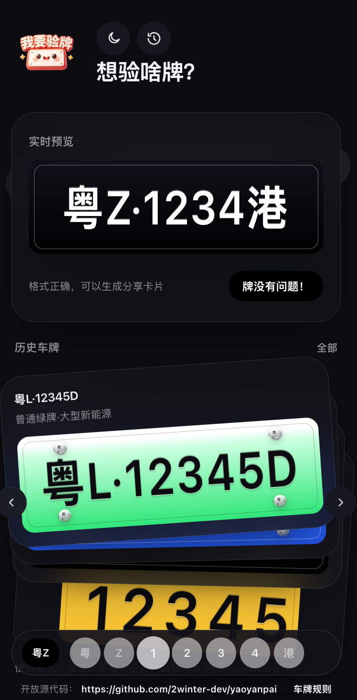
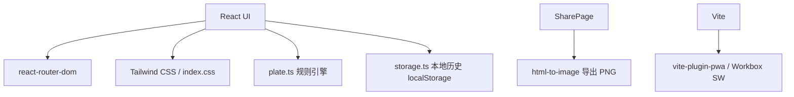

# 我要验牌（PWA）· 车牌模拟器

<p align="center">
  <a href="https://github.com/2winter-dev/yaoyanpai">开源地址：github.com/2winter-dev/yaoyanpai</a>
</p>

鸿蒙原生6.1已上线<a href="https://appgallery.huawei.com/app/detail?id=com.lelepig.carmodel&channelId=SHARE&source=appshare">车牌DIY模拟器</a>


<p align="center">
  
  
  
  
  
  
  
  
</p>

<p align="center">
  <a href="https://github.com/2winter-dev/yaoyanpai/stargazers">
    
  </a>
</p>

> 基于 **Trae SOLO 3.0** 协助开发

「我要验牌」是一款偏“拟真”的 **车牌 DIY 模拟器**（PWA）：支持多种车牌样式与规则校验、历史记录、以及一键生成分享图片（含“仅车牌”导出模式）。

## 预览

> 截图位于 `preview/` 目录。




## 特点 / 功能

### 车牌类型与规则支持

支持（并内置默认示例牌）：

- **普通蓝牌**：省简称 + 发牌字母 + 5 位（数字/字母，排除 I/O）
- **普通新能源绿牌**
  - 小型：第 3 位为 **D/F**（示例：`粤A·D12345`）
  - 大型：最后 1 位为 **D/F** 等新能源字母（示例：`粤A·12345D`）
- **普通摩托车牌**（黄底黑字、两行排版）：省简称 + 发牌字母 + 5 位数字（示例：`粤A12345`）
- **粤Z（港/澳）两地牌**：`粤Z·xxxx港/澳`（组件内按两地牌格式展示）
- **FV / FU / FT**
  - FV / FU：广东两地牌（黄底黑字默认后牌展示）
  - FT：粤车南下（黄底黑字默认后牌展示）
- **香港车牌**
  - 支持 **纯数字 1~9999**
  - 支持 **2 字母 + 1~4 位数字**
- **澳门车牌**：按 `MA-12-34` 形式展示
- **台湾省车牌**：按 `ABC-1234` 形式展示

### 分享生图 / 导出

- 生成可分享卡片（“牌没有问题！”）并保存到历史
- **保存图片**：导出 PNG
- **系统分享**：设备支持时调用 Web Share API
- **仅车牌开关**：导出图片只包含车牌组件（无 banner / 文案）

### PWA / 离线能力

- `vite-plugin-pwa` + Workbox 生成 Service Worker
- 断网可使用核心功能（输入 / 渲染 / 历史 / 分享导出）
- 支持安装到桌面（Standalone）

### 主题与体验

- 夜间模式：Auto / Light / Dark
- 历史记录：堆叠浏览 + 列表浏览（含分享按钮）
- 牌面拟真细节：宽高比、边框、螺丝孔位/固封装置、浮雕字效等

## 技术架构



## 页面路由

- `/`：DIY 车牌 + 实时预览 + 底部输入条
- `/history`：历史记录（堆叠/列表、分享/删除/清空）
- `/share/:id`：分享卡片（保存/系统分享、仅车牌开关）

## 快速开始

### 开发

```bash
yarn
yarn dev
```

### 构建（含 PWA 离线资源）

```bash
yarn build
yarn preview
```

## PWA 安装

- Chrome / Edge：地址栏右侧「安装」图标 → 安装到桌面
- iOS Safari：分享 → 添加到主屏幕

## 目录结构

- `src/pages/*`：Home / History / Share
- `src/components/*`：车牌预览、输入条、键盘、历史堆叠等
- `src/components/plates/*`：各类车牌模板渲染
- `src/lib/plate.ts`：规则与校验、展示格式
- `src/lib/storage.ts`：历史记录存储
- `vite.config.ts`：PWA manifest / Workbox 配置

## 车牌规则参考

- 百度百科（车牌）：<https://baike.baidu.com/item/%E8%BD%A6%E7%89%8C/8347320>

## 为项目点赞

[](https://star-history.com/#2winter-dev/yaoyanpai&Date)

## 许可与使用限制

> 本仓库目前为「非商业用途」开源分享。

- **禁止商用**：不得将本项目（或其衍生作品）用于任何商业目的，包括但不限于售卖、付费分发、商业宣传、或作为商业产品/服务的一部分。
- **允许二次开发**：允许 Fork / 修改 / 二次开发。
- **必须注明来源**：二次开发或再发布时，需在显著位置注明来源并保留本仓库链接：<https://github.com/2winter-dev/yaoyanpai>

## 免责声明

本项目为「拟真 UI + 规则模拟」用途，结果仅供娱乐/学习参考，不代表任何官方标准或执法依据。
